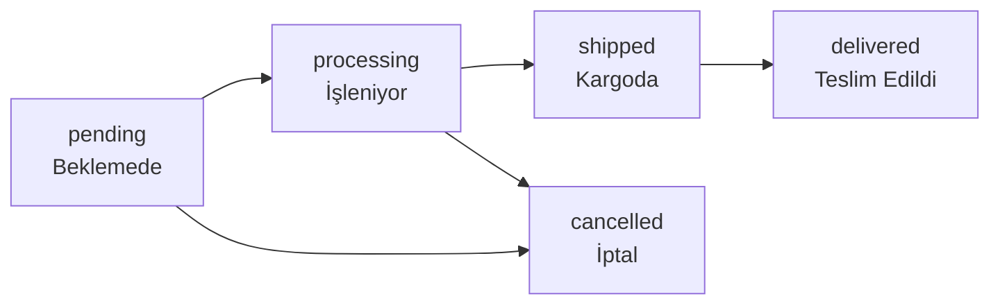

# 04 — İş Kuralları & Domain Mantığı

> Patenli Ayakkabılar e-ticaret platformunun iş kuralları ve domain mantığı.

---

## Ürün Yönetimi

### Ürün Yapısı

Her ürün (Product) birden fazla varyant (ProductVariant) içerir:

```
Product (Ana Ürün)
├── name, slug, description, price, is_active
├── category_id (BelongsTo: Category)
├── images (JSON array)
├── SoftDeletes
└── ProductVariant (Varyantlar)
    ├── color          → Renk seçimi
    ├── size           → Beden: 28, 29, 30, ... 45
    ├── wheel_type     → Tekerlek tipi
    ├── stock          → Stok adedi (varyant bazında)
    ├── sku            → Benzersiz stok kodu
    └── price_override → Varyanta özel fiyat (opsiyonel)
```

### Stok Kuralları

| Kural | Açıklama |
|---|---|
| Stok varyant bazında tutulur | Ana üründe stok tutulmaz |
| Stok sıfıra düşünce | Varyant satışa kapanır, ürün aktif kalır |
| Tüm varyantlar stoksuz olunca | Ürün listede "Tükendi" olarak görünür |
| Sipariş onayında stok düşer | `OrderObserver::created()` ile |
| İptal edilince stok geri eklenir | `OrderObserver::updated()` ile |
| Düşük stok eşiği | 5 adet (LowStockAlertWidget'ta uyarı) |

### Beden Tablosu

```
Çocuk  : 28, 29, 30, 31, 32, 33, 34, 35
Yetişkin: 36, 37, 38, 39, 40, 41, 42, 43, 44, 45
```

### Soft Delete

- Ürünler silindiğinde `deleted_at` alanı dolar.
- Silinen ürünler frontend'de görünmez.
- Admin panelde "Çöp Kutusu" filtresi ile erişilebilir.
- Sipariş geçmişinde silinen ürünler hâlâ görünür (`withTrashed`).

---

## Kategori Yönetimi

### Hiyerarşik Yapı (Self-Reference)

```
categories
├── id
├── name
├── slug
├── parent_id  → NULL ise ana kategori
├── is_active
└── sort_order
```

Örnek:

```
Patenli Ayakkabılar (parent_id: null)
├── Çocuk Modelleri (parent_id: 1)
│   ├── Kız Çocuk (parent_id: 2)
│   └── Erkek Çocuk (parent_id: 2)
├── Yetişkin Modelleri (parent_id: 1)
└── Aksesuarlar (parent_id: 1)
```

---

## Sipariş Akışı

### Sipariş Durumları (Order Status)



| Durum | Kod | Açıklama | Renk |
|---|---|---|---|
| Beklemede | `pending` | Sipariş alındı, ödeme bekleniyor | warning (sarı) |
| İşleniyor | `processing` | Ödeme onaylandı, hazırlanıyor | info (mavi) |
| Kargoda | `shipped` | Kargo şirketine teslim edildi | primary (turuncu) |
| Teslim Edildi | `delivered` | Müşteriye ulaştı | success (yeşil) |
| İptal | `cancelled` | Sipariş iptal edildi | danger (kırmızı) |

### Ödeme Durumları (Payment Status)

| Durum | Kod | Açıklama |
|---|---|---|
| Beklemede | `pending` | Ödeme henüz alınmadı |
| Ödendi | `paid` | Ödeme başarıyla alındı |
| İade Edildi | `refunded` | Ödeme iade edildi |
| Başarısız | `failed` | Ödeme başarısız oldu |

### Kargo Şirketleri

| Şirket | Kod | Takip URL Formatı |
|---|---|---|
| Yurtiçi Kargo | `yurtici` | `https://www.yurticikargo.com/tr/online-servisler/gonderi-sorgula?code={tracking}` |
| Aras Kargo | `aras` | `https://www.araskargo.com.tr/taki.aspx?kod={tracking}` |
| MNG Kargo | `mng` | `https://www.mngkargo.com.tr/gonderi-takip/{tracking}` |
| PTT Kargo | `ptt` | `https://gonderitakip.ptt.gov.tr/Track/Verify?q={tracking}` |
| UPS | `ups` | `https://www.ups.com/track?tracknum={tracking}` |

### Sipariş Verileri

```php
Order::create([
    'user_id'          => $user->id,
    'order_number'     => 'PA-' . date('Ymd') . '-' . str_pad($id, 4, '0', STR_PAD_LEFT),
    'status'           => 'pending',
    'payment_status'   => 'pending',
    'subtotal'         => 450.00,
    'discount'         => 50.00,
    'shipping_cost'    => 29.90,
    'total'            => 429.90,
    'cargo_company'    => 'yurtici',
    'tracking_number'  => null,
    'shipping_address' => json_encode([...]),
    'notes'            => 'Hediye paketi yapılsın',
]);
```

---

## Kupon Sistemi

### Kupon Yapısı

| Alan | Tip | Açıklama |
|---|---|---|
| `code` | string | Benzersiz kupon kodu (uppercase) |
| `type` | enum | `percentage` veya `fixed` |
| `value` | decimal | İndirim değeri (% veya ₺) |
| `min_cart_total` | decimal | Minimum sepet tutarı |
| `usage_limit` | integer | Maksimum kullanım sayısı |
| `used_count` | integer | Kaç kez kullanıldı |
| `expires_at` | datetime | Son kullanma tarihi |
| `is_active` | boolean | Aktif/pasif |

### Kupon Validasyon Kuralları

```php
// Kupon geçerlilik kontrolleri (sırasıyla)
1. Kupon kodu mevcut mu?
2. is_active === true ?
3. expires_at > now() ?
4. used_count < usage_limit ?
5. Sepet toplamı >= min_cart_total ?

// İndirim hesaplama
if ($coupon->type === 'percentage') {
    $discount = $cartTotal * ($coupon->value / 100);
} else {
    $discount = $coupon->value;  // Sabit tutar
}

// İndirim sepet toplamını geçemez
$discount = min($discount, $cartTotal);
```

---

## Kullanıcı Rolleri

| Rol | Kod | Yetkiler |
|---|---|---|
| Admin | `admin` | Filament panel erişimi, tüm CRUD |
| Müşteri | `customer` | Frontend, sipariş, profil yönetimi |

```php
// Admin kontrolü
if ($user->role === 'admin') {
    // Filament panel erişimi
}
```

---

## Müşteri Puanlama (Customer Scoring)

### RFM Tabanlı Algoritma

| Metrik | Ağırlık | Hesaplama |
|---|---|---|
| **Purchase Score** | %30 | Toplam sipariş sayısı + toplam harcama |
| **Activity Score** | %20 | Son ziyaret, sayfa görüntüleme, sepet aktivitesi |
| **Loyalty Score** | %25 | İlk siparişten bu yana geçen süre + tekrar alım oranı |
| **Engagement Score** | %25 | Yorum, favori, kupon kullanımı |

### Toplam Skor Hesaplama

```php
$totalScore = ($purchaseScore * 0.30)
            + ($activityScore * 0.20)
            + ($loyaltyScore  * 0.25)
            + ($engagementScore * 0.25);

// Skor: 0-100 arası normalize edilir
```

### Müşteri Katmanları (Tiers)

| Katman | Skor Aralığı | Renk | Açıklama |
|---|---|---|---|
| 🏆 VIP | 80 – 100 | success (yeşil) | En değerli müşteriler |
| ⭐ Değerli | 60 – 79 | info (mavi) | Sadık ve aktif müşteriler |
| 👤 Normal | 40 – 59 | warning (sarı) | Orta seviye müşteriler |
| 📉 Düşük | 20 – 39 | warning (turuncu) | Etkileşimi azalan müşteriler |
| 🆕 Yeni | 0 – 19 | gray | Yeni kayıt / veri yetersiz |

---

## Phoenix AI Zamanlaması

| Saat | Komut | Açıklama |
|---|---|---|
| 03:00 | `phoenix:scores` | Tüm müşteri skorlarını yeniden hesapla |
| Her 2 saat | `phoenix:recommendations` | Yeni öneri üret (6 tip) |
| 03:30 | `phoenix:sync-segments` | Segment üyeliklerini güncelle |

### Öneri Tipleri

| Tip | Açıklama | Öncelik |
|---|---|---|
| `stock_alert` | Düşük stok uyarısı | critical |
| `customer_retention` | Müşteri kaybı riski | high |
| `vip_at_risk` | VIP müşteri risk altında | critical |
| `revenue_drop` | Gelir düşüşü tespit | high |
| `abandoned_carts` | Terk edilmiş sepetler | medium |
| `vip_opportunity` | VIP potansiyeli olan müşteri | medium |

---

## İş Kuralları Özet Tablosu

| Kural | Detay |
|---|---|
| Minimum sipariş tutarı | Yok (yapılandırılabilir) |
| Ücretsiz kargo eşiği | Yapılandırılabilir (Settings tablosu) |
| Stok kontrolü | Varyant bazında, sipariş anında |
| Ürün silme | Soft delete, sipariş geçmişi korunur |
| Kupon birleştirme | Sipariş başına tek kupon |
| Sipariş numarası formatı | `PA-YYYYMMDD-XXXX` |
| Para birimi | ₺ (Türk Lirası), 2 ondalık |
| Vergi | Fiyata dahil (KDV) |
